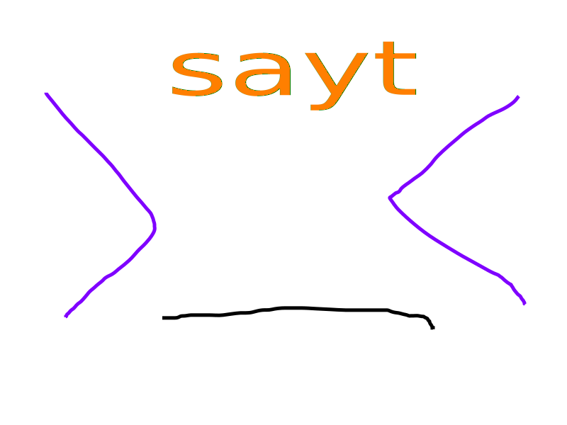

# SAYT (Say-it)



SAYT 是一个通过命令行与语言模型（LLM）交互的工具。它允许用户通过终端中的简单命令与 AI 助手进行通信。

## 目录
- [安装](#安装)
- [初始化](#初始化)
- [使用](#使用)

## 安装

要安装 SAYT，请使用以下命令：

```sh
go install github.com/Disdjj/sayt
```

## 初始化

安装后，使用以下命令初始化 SAYT：

```sh
sayt init
```

此命令设置 SAYT 与 LLM 交互所需的必要配置。

## 配置
打开文件 `~/sayt/config.toml`
输入你的 `api-host`/`api-key`/`model`

## 使用

要使用 SAYT 并与 AI 助手交互，请使用以下命令格式：

```sh
sayt use assistant '你的消息在这里'
```

例如：

```sh
sayt use assistant 'hello'
```

此命令将消息 "hello" 发送给 AI 助手并返回响应。
